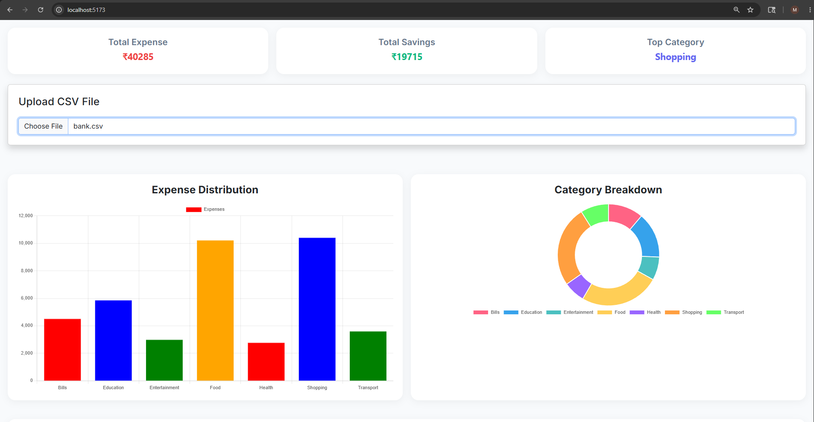
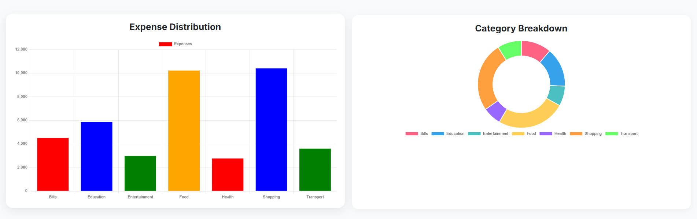

# 💰 AI Financial Expense Analyzer

An intelligent financial analytics platform that allows users to upload bank statements and generate powerful visual insights, analytics dashboards, and AI-driven financial summaries.

Built using modern full-stack technologies including React, FastAPI, MySQL, Pandas, and Chart.js.

---

# 🚀 Features

## 📂 Smart CSV/Bank Statement Upload
- Upload bank statements or CSV transaction files
- Automatic transaction parsing
- Dynamic analytics generation

## 📊 Interactive Dashboard
- Expense distribution charts
- Monthly spending trends
- Category-wise analytics
- Savings tracking
- Top spending category detection

## 🤖 AI Financial Insights
- Smart financial observations
- Expense behavior analysis
- Savings insights
- Category-based spending summaries

## 📈 Dynamic Data Visualization
- Bar Charts
- Pie Charts
- Line Charts
- Responsive analytics dashboard

## 🎨 Modern UI/UX
- Minimal SaaS-style dashboard
- Responsive design
- Sidebar navigation
- Smooth hover animations
- Modern card-based layout

---

# 🛠️ Tech Stack

## Frontend
- React.js
- Bootstrap
- Chart.js
- CSS3

## Backend
- FastAPI
- Python
- Pandas 

---

# 📸 Screenshots

## 🏠 Dashboard Overview

---

## 📊 Expense Distribution

---

## 🤖 AI Insights

---

# ⚙️ Installation & Setup

## 1️⃣ Clone the Repository

git clone https://github.com/MeghanshMohabey/Expense_Analyzer.git

---

## 2️⃣ Frontend Setup

cd frontend
npm install
npm run dev

---

## 3️⃣ Backend Setup

cd backend
pip install -r requirements.txt
uvicorn main:app --reload

---

# 🔄 Workflow

CSV Upload
    ↓
React Frontend
    ↓
FastAPI Backend
    ↓
Pandas Data Processing
    ↓
Chart.js Visualization

---

# 📊 Future Enhancements

- 🔐 User Authentication
- 📈 Expense Forecasting
- 🤖 AI-Based Fraud Detection
- 🌙 Dark Mode
- 📱 Mobile Responsive Dashboard
- 🧠 Machine Learning Insights
- ☁️ Cloud Deployment

---

# 🎯 Learning Outcomes

Through this project, I explored:

- Full-stack web development
- Data visualization techniques
- Financial analytics workflows
- Dashboard UI/UX design
- API integration
- Database management

---

# 👨‍💻 Author

## Meghansh Mohabey

- Frontend Developer
- Data Science Student
- Passionate about Web Development & Analytics

---

# ⭐ If You Like This Project

Give it a star and feel free to contribute.
